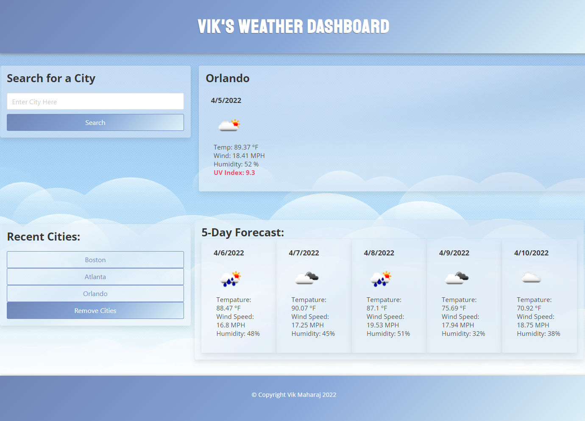

# Vik's Weather Dashboard

## Description

For someone who travels a lot, staying up to date with the weather is really important. It is imperative to know what to expect weather-wise when traveling before they arrive at their next destination. That person needs the ability to look at forecasts for several cities at once, and have that advanced knowledge so they can plan accordingly.

Enter the purpose of this project: to allow a user to select a city of their choice and quickly see the current weather of that location, and the expected weather for the next five days. The app runs entirely in the browser, can be viewed anywhere online, and includes the following features:

- When a user searches for a city, they are presented with the current and future weather conditions for that city
- The currently displayed city is then added to the user’s search history and listed on the page
- When a user views current weather conditions for a city they are presented with the city name, current date, icon of current weather conditions, temperature, humidity, wind speed, and UV index
- When a user views the UV Index, they are presented with a color that indicates whether the conditions are favorable, moderate, or severe (green, yellow, or red)
- When a user views the future weather conditions for that city, they are presented with a 5-day forecast that displays the date, icon of current weather conditions, temperature, wind speed, and humidity
- When a user clicks on a city in their list of previously searched cities, they are again presented with the current weather information for that city

Link to the deployed website: https://vik-maharaj.github.io/weather-dashboard/

## Installation

The repo contains an index.html file, and assets folder containing a CSS file sytlesheet, an image folder, and a javascript folder. These files were deployed at the above-mentioned link using GitHub Pages. The repo can also be cloned to a local machine and the index.html file can be opened in any web browser or IDE of choice.

## Usage

Using any desktop browser, open the above-mentioned link to view the webpage.

## Credits

Collaborators include the instructor, TAs, and fellow classmates of the UCF Coding Bootcamp (Spring 2022).

## License

Copyright (c) 2022 Vik Maharaj

Permission is hereby granted, free of charge, to any person obtaining a copy of this software and associated documentation files (the "Software"), to deal
in the Software without restriction, including without limitation the rights to use, copy, modify, merge, publish, distribute, sublicense, and/or sell copies of the Software, and to permit persons to whom the Software is furnished to do so, subject to the following conditions:

The above copyright notice and this permission notice shall be included in all copies or substantial portions of the Software.

THE SOFTWARE IS PROVIDED "AS IS", WITHOUT WARRANTY OF ANY KIND, EXPRESS OR IMPLIED, INCLUDING BUT NOT LIMITED TO THE WARRANTIES OF MERCHANTABILITY,
FITNESS FOR A PARTICULAR PURPOSE AND NONINFRINGEMENT. IN NO EVENT SHALL THE AUTHORS OR COPYRIGHT HOLDERS BE LIABLE FOR ANY CLAIM, DAMAGES OR OTHER LIABILITY, WHETHER IN AN ACTION OF CONTRACT, TORT OR OTHERWISE, ARISING FROM, OUT OF OR IN CONNECTION WITH THE SOFTWARE OR THE USE OR OTHER DEALINGS IN THE SOFTWARE.

## Badges

